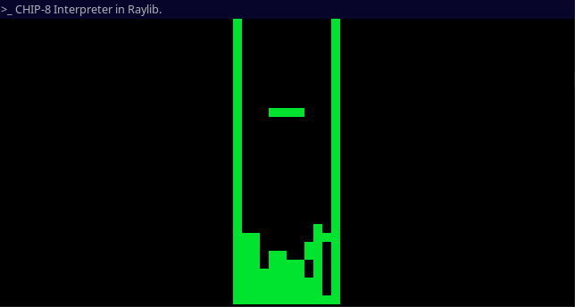
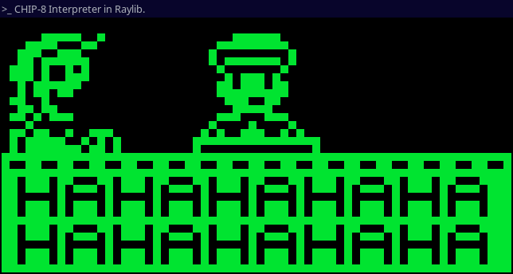

# About
CHIP-8 emulator written in C++ with Raylib. <br>
This emulator/interpreter provides a modern implementation with cycle-accurate timing and original hardware quirks.
> **Note:** Place your ROM files in a ROMs directory like so, (`/CHIP8/ROMs`). They must be .ch8 files so, if you have a chip8 ROM that ends in anything other than that, you can simply rename it.

## Controls
```
CHIP-8        Keyboard
1 2 3 C       1 2 3 4
4 5 6 D   →   Q W E R
7 8 9 E       A S D F
A 0 B F       Z X C V
```
### Future Goals
- [ ] GUI Debugger
- [x] ROM Browser
- [ ] Custom Key Mapping
- [ ] Adjustable CPU speed
- [ ] Configurable Quirks

# Build Instructions

Before building the CHIP8 emulator, you'll need:
- C++ compiler, i guess
- Raylib
- Place your ROMs like this (`/CHIP8/ROMs`).
- Make sure you are in (`A-CHIP-8-Interpreter/CHIP8/`) to run the following commands.

## Commands

### Linux
```bash
mkdir -p src/build
g++ -std=c++17 -Wall -Wextra -o src/build/chip8_emulator src/*.cpp -lraylib -lGL -lm -lpthread -ldl -lrt -lX11
```

### macOS
```bash
mkdir -p src/build
g++ -std=c++17 -Wall -Wextra -o src/build/chip8_emulator src/*.cpp -lraylib -framework OpenGL -framework Cocoa -framework IOKit -framework CoreVideo
```

### Windows (MSYS2/MinGW)
```bash
mkdir -p src/build
g++ -std=c++17 -Wall -Wextra -o src/build/chip8_emulator.exe src/*.cpp -lraylib -lopengl32 -lgdi32 -lwinmm
```

## Running the Emulator
After building, run the emulator from the build directory:

```bash
# Linux/macOS
cd src/build
./chip8_emulator

# Windows
cd src\build
.\chip8_emulator.exe
```
The emulator will list available ROM files from the `../ROMs` directory and prompt you to select one.

## Troubleshooting
- If you encounter linking errors, ensure Raylib is properly installed
- Debug logs are written to `debuglog.txt` in the current directory
- Make sure your ROMs are in the correct location.

# Development
- This emulator was developed and tested using this excellent [CHIP-8 Test Suite](https://github.com/Timendus/chip8-test-suite) by [Timendus](https://github.com/Timendus)
- [Raylib](https://www.raylib.com/) is the video/audio library of choice.

## Screenshots:
### Tetris

- [Tetris ROM](https://github.com/soupi/chip-8/tree/master/roms)
<br>

### Ace Attorney <br>

- [Ace Attorney ROM](https://github.com/JohnEarnest/chip8Archive/tree/master/src/8ceattourny_d3)